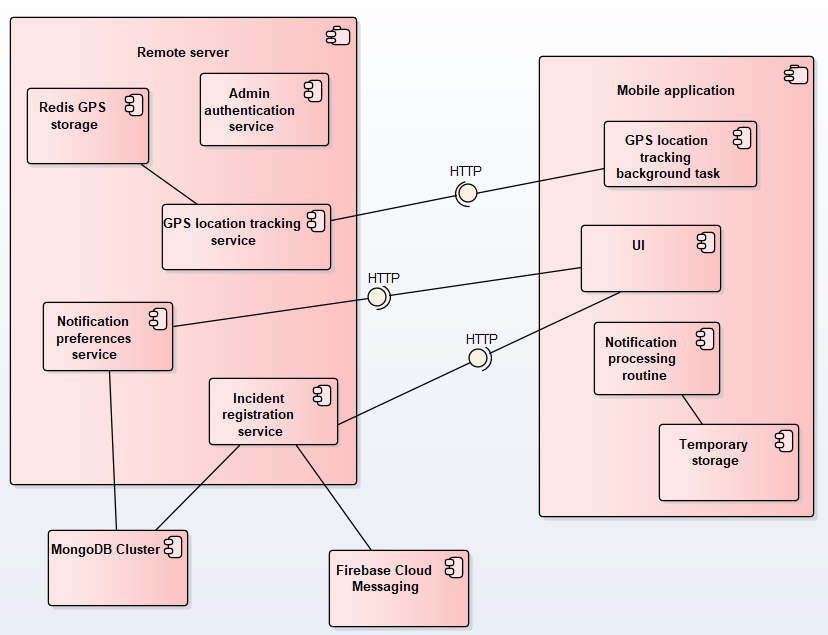

<p align="center">
   
</p>
<h1 align="center">Hermes - Real-Time Notification System</h1>

Microservice-based distributed system with both mobile and web clients for sending real-time notifications about natural disasters and emergencies.

## Introduction

The initial idea was to develop a prototype of a highly available system for sending critical notifications to the users about various incidents which may affect them. It was obvious that the solution is not going to address all the requirements of a similar real-world system therefore certain simplifications were made, having preserved at the same time the main functionality of a real-time notification system even with some enhancements, considering the existing solutions.

* The system gives users the possibility to receive real-time notifications based on their location and notification preferences, and to personalize them by choosing to receive certain types of alerts. It means that there is the list of incident categories about which users should be alerted in any case (floods, wildfires, earthquakes, etc.) and the set of categories which users may subscribe to, for example, Weather and Air Quality.

* The users may report the incident which happened in their area and also view the history of incident notifications they've already received.

* The administrators can observe in real-time user reports, validate or discard them and also report the incidents by themselves according to the verified sources.

All of these features are related to the particular components of the system: their structure and communication is explained in the next section.

## Architecture Overview

The following UML component diagram presented the general structure of this real-time notification system:



The diagram demonstrates the main components of the system: **Remote Backend Server** and **Client Mobile Application**. The **AdminDashboard** is not taken into consideration as its structure is relatively simple and does not require long explanations (its interface can be viewed in the demo section).

The **Remote Backend Server** represents a distributed application based on four major microservices with a gateway in front of them:

* **AdminAuthenticationService** performs basic login/registration operations and issues a JWT token to the admin users to have access to the incident report and validation actions. It is the only service which is not accessible from the gateway but instead should be called directly.
  
* **NotificationPreferencesService** registers user prederences on the incident notifications and interracts with **MongoDB** where it stores incident categories and user preferences mapped to the user device identifiers (Firebase Cloud Messaging (FCM) Tokens).
  
* **GPSLocationTrackingService** processes requests from the user devices and stores their GPS location inside of the **Redis Geo Index** using as key device FCM tokens.
  
* **IncidentRegistrationService** gives admins the possibility to view/report/validate/update/delete incidents and also permits the users to report emergency situation. However, it is important to mention several moments here. First of all, this service validates user reports in order to check whether similar reports were already submitted (by checking the radius of the incident area and its category). Secondly, it performs notification transmission using **Firebase Cloud Messaging** service based in user notification preferences and their current GPS location.

The **Client Mobile Application** makes use of the apis exposed by the backend server and contains the following modules:

* **UI** represents the interface of the application itself visible to the user, its overview is available in the demo section.

* **GPS location tracking background task** is the task which runs from the moment the application is first opened and periodically sends user device GPS location to the backend server. Moreover, the task only sends new data when the previous location has changed by a certain value expressed by the area radius.

* **Notification processing routine** is responsible for handling incoming **Firebase push-notifications**. Upon receiving the notification, it stores the value of the message in the **Temporary storage** which, by the way, is persistent in case of application shutdown. The storage is called temporary because it maintains a certain number of notifications having been received by the device and the list of them from time to time.


## Technology Stack and Communication Patterns

- Server Backend: **.NET Aspire** + **SignalR** + **MongoDB** + **Redis**
- Mobile Client: **Expo React Native** + **Expo Notifications** + **Async Storage** + **NativeWind**
- Admin Web Client: **Angular** + **SignalR** + **Material Design**
- Push notification service: **Firebase Cloud Messaging**

The communication between the client components of the system and the server are mainly performed via **HTTP** requests. The only exception is the real-time connection between the web client and the server which uses **SignalR** with **Websockets** as the transport protocol. This setup can be changed to **SSE** or **Long polling** options. The rest of the commmunication is performed via **Firebase push notifications** (from the server to the mobile client).

## Setup and Execution

#### Server Backend

In order to start the .NET Aspire distributed application it is necessary to add files with secrets to the certain microservices. The general appearance of a `.env` file shared by the services is the following:

```env
MONGODB_CONNECTION_STRING=mongodb+srv://<<your_user>>:<<your_password>>@master.r1peu.mongodb.net/?<<your_auth_source>>=&appName=<<your_app_name>>
MONGODB_DATABASE=<<your_db_name>>

JWT_SECRET=<<your_jwt_secret>>
JWT_ISSUER=HermesBackend
JWT_AUDIENCE=HermesMobileApp
JWT_LIFETIME_MINUTES=30
```

All of the secrets are required only by the **IncidentRegistrationService** and **AdminAuthnticationService**. The **NotificationPreferencesService** only needs to contain the MongoDb connection data. This file should be placed at the root of each service directory. 

In addition to the `.env` file you should provide the **IncidentRegistrationService** with the `hermes-firebase-adminsdk.json` file. For that you need to create a Firebase project and proceed as described in the official documentation: https://firebase.google.com/docs/admin/setup#c. Finally, place the downloaded JSON file into the `IncidentRegistrationService` folder under the name `hermes-firebase-adminsdk.json`.

1. Once you are finished with the previous steps run the following command from the `ServerBackend` folder (or open the `ServerBackend` solution in Visual Studio):

   ```bash
   dotnet run
   ```

2. By default the .NET Aspire dashboard will be available at `http://localhost:17206`

#### Mobile Client

In order to test the Expo mobile client you need to add files with secrets to the root of the `MobileFrontend` directory. The general appearance of a `.env` file is the following (do not forget that the ip address of the .NET Aspire app gateway should be without `localhost` in case of local development, but instead 192.168....):

```env
API_GATEWAY_URL=<<gateway_ip_address>>
LOCATION_TRACKING_TASK=location-tracking
LOCATION_TRACKING_TIME_INTERVAL=15000
LOCATION_TRACKING_DISTANCE_INTERVAL=100
NOTIFICATION_BUFFER_SIZE=20
```

The mobile client just like the server backend also requires a special JSON file `google-services.json` with Firebase secrets. The steps to obtain it are described in the documentation: https://firebase.google.com/docs/android/setup. Remember, that you just need to download the file and place it into the `MobileFrontend` directory. Moreover, the `Android Package name` mentioned in the docs can be found in the Expo `app.json` file, now it has the value `com.project_alpha.hermes`.

1. Once all the files are prepared you can open the `/android/app` folder in Android Studio, build and run it as a project. 

2. Also run the following commands from the root of the `MobileFrontend` folder to start the Metro Server:

   ```bash
   npm install
   npx expo start
   ```

The output of the last command will show you the Metro Server url and the qr code to test the app using Expo Go from your phone. However, the functionality of the app will be limited, so it's better to use an emulator in Android Studio.

#### Admin Web Client

1. Navigate to the `AdminDashboard` folder from the root of the repository and run the following commands:
   
   ```bash
   npm install
   ng serve
   ```
   
2. By default the Angular web page will be available at `http://localhost:4200`

## Demo

## Further Steps
